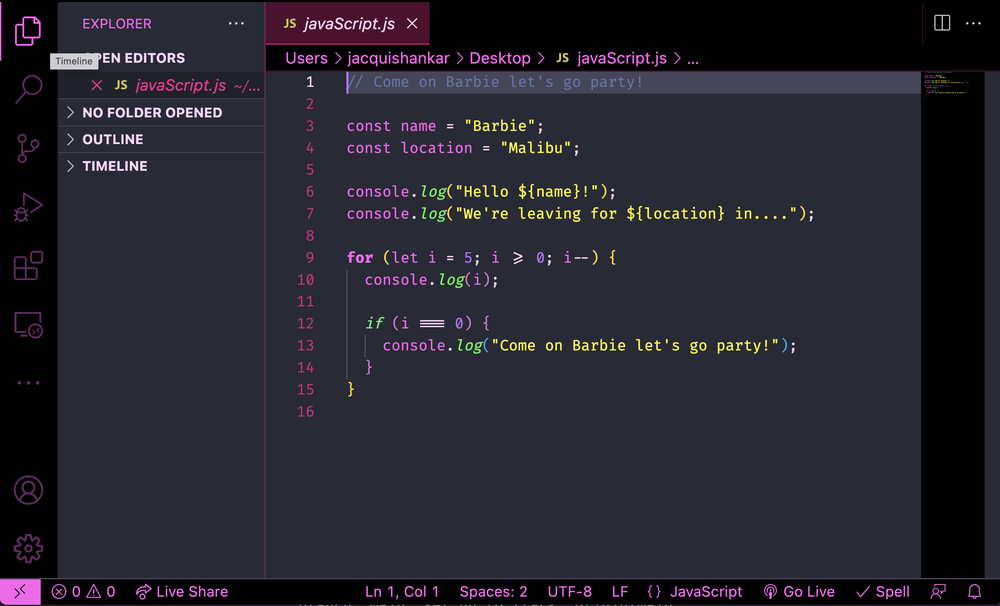

# Barbie Sherbet 🦩

A Visual Studio Code theme inspired by the colourful world of Barbie. The colour theme default is set to dark mode to remain kind to the eyes, while taking advantage of a range of fun and bright colours typically associated with the Barbie colour palate. As a result of this, the colours have not taken into consideration accessibility and therefore may pose some colour contrast issues for some.

## Barbie Sherbert

## Colour Palate 🎨

| Palette      | Hex       | RGB           | HSL             | 🖌                                                        |
| ------------ | --------- | ------------- | --------------- | -------------------------------------------------------- |
| Background   | `#282a36` | `40 42 54`    | `231° 15% 18%`  |  |
| Current Line | `#44475a` | `68 71 90`    | `232° 14% 31%`  |  |
| Selection    | `#44475a` | `68 71 90`    | `232° 14% 31%`  |  |
| Comment      | `#6272a4` | `98 114 164`  | `225° 27% 51%`  |  |
| Blue         | `#489af2` | `72 154 242`  | `211° 87% 62%`  |  |
| Green        | `#50fa7b` | `80 250 123`  | `135° 94% 65%`  |  |
| Orange       | `#ffdb00` | `255 219 0`   | `52° 100% 50%`  |  |
| Yellow       | `#fffc0e` | `255 252 14`  | `59° 100% 53%`  |  |
| Dark Pink    | `#ff1092` | `255 16 146`  | `327° 100% 53%` |  |
| Barbie Pink  | `#ff79c6` | `255 121 198` | `326° 100% 74%` |  |
| Baby Pink    | `#ffd4fd` | `255 212 253` | `303° 100% 92%` |  |
| Purple       | `#be6cff` | `190 108 255` | `273 100% 71%`  |  |
| Dark Purple  | `#8d3ff7` | `141 63 247`  | `265° 92% 61%`  |  |

## Inspiration

After hearing about and seeing the various VS Code themes, I wanted to challenge myself to try and create one myself. I anticipated this would help familiarise myself more with using Node while having some fun along the way. The decision to adopt a Barbie colour theme simply came from the idea of creating something bright and energetic for the user to interact with while coding.

While I don't feel the journey has developed any further skills with Node, it has been fun and given me more to think about in the sense of accessibility and some of the consideration some creators put into practice, the [Night Owl](https://github.com/sdras/night-owl-vscode-theme) theme perhaps being one of the best examples I came across.

**Enjoy!**
